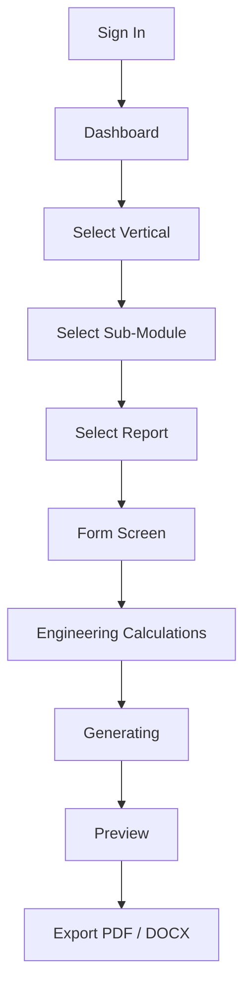
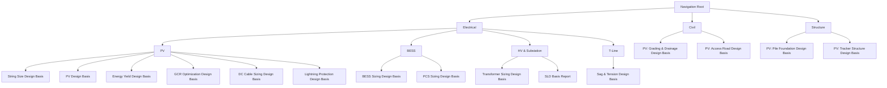
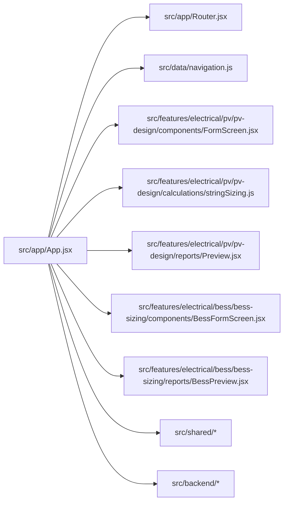

# Forge Graph

This file turns the current workspace into a quick-read architecture graph for the main product flows.

## Application Flow

## Navigation Graph

## Code Map

## Key Files

- [src/app/App.jsx](src/app/App.jsx)
- [src/app/Router.jsx](src/app/Router.jsx)
- [src/data/navigation.js](src/data/navigation.js)
- [README.md](README.md)
- [PROJECT.md](PROJECT.md)

