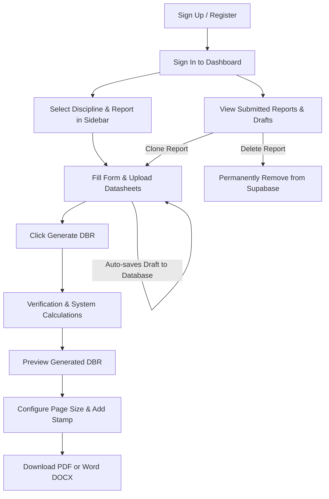

# Forge: User Onboarding & Department Guide
Welcome to **Forge**, the Engineering Design Basis Report (DBR) Automation Platform. Forge is designed to streamline engineering workflows by allowing you to enter project parameters once, perform automatic calculations, and instantly output standardized, client-ready reports.

This guide walk you through how to use Forge from account creation to generating, downloading, cloning, and deleting reports.

---

## Table of Contents
1. [User Journey Overview](#user-journey-overview)
2. [Account Setup & Authentication](#1-account-setup--authentication)
   - [Creating an Account](#creating-an-account)
   - [Logging In](#logging-in)
   - [Password Reset & Dev Bypass](#password-reset--developer-bypass)
3. [Sidebar & Navigation Controls](#2-sidebar--navigation-controls)
   - [Moving Between Departments & Reports](#moving-between-departments-and-reports)
   - [Search & Sidebar Controls](#search-bar--collapsing-the-sidebar)
   - [Status Badges Explained](#status-badges-explained)
4. [Filling Input Forms & Auto-Saving](#3-filling-input-forms--auto-saving)
   - [Data Entry Form Structure](#data-entry-form-structure)
   - [Technical Datasheet & File Uploads](#technical-datasheet--file-uploads)
   - [Auto-Save Drafts & Supabase Integration](#auto-save-drafts--supabase-integration)
   - [Resetting Inputs](#resetting-inputs)
5. [Generating & Previewing Reports](#4-generating--previewing-reports)
   - [Running Calculations](#running-calculations)
   - [The Generation Loading Flow](#the-generation-loading-flow)
6. [Exporting & Downloading Reports](#5-exporting--downloading-reports)
   - [Selecting Formats (PDF / Word)](#selecting-formats-pdf--word)
   - [Configuring Page Sizes & Custom Certification Stamps](#configuring-page-sizes--custom-certification-stamps)
7. [Managing Existing Reports](#6-managing-existing-reports)
   - [Cloning Reports (Drafting Variations)](#cloning-reports-drafting-variations)
   - [Deleting Reports](#deleting-reports)
8. [Department Directory & Coded Reports](#7-department-directory--coded-reports)
   - [Electrical Department (Active)](#electrical-department-active)
     - [PV Design Basis](#pv-design-basis)
     - [BESS Sizing Design Basis](#bess-sizing-design-basis)
     - [BESS Cable Ampacity](#bess-cable-ampacity)
     - [BESS Grounding Design Basis](#bess-grounding-design-basis)
     - [HV & Substation Design Basis](#hv--substation-design-basis)
   - [Civil & Structure Departments (Soon)](#civil--structure-departments-soon)

---

## User Journey Overview

The flowchart below displays the lifecycle of report creation in Forge:



---

## 1. Account Setup & Authentication

Forge features a secure, corporate authentication interface built on top of **Supabase Auth**.

### Creating an Account
To access Forge for the first time, you must register a new corporate profile.

1. Navigate to the login page and click **Sign up**.
2. Fill in the required fields:
   - **Full Name**: Enter your legal name (e.g., *Aman Sharma*). This name is used to sign off reports in the "Prepared By" metadata field.
   - **Email**: Enter your corporate email address (e.g., *you@company.com*).
   - **Department**: Choose your engineering department from the dropdown menu (**Electrical**, **Civil**, or **Structural**). This configures your default workspace view.
   - **Password**: Create a secure password (must be at least 8 characters).
   - **Confirm Password**: Re-enter your password to prevent typos.
3. Click the **Sign up** button.
4. If confirmation is required, you will see a notice instructing you to check your email inbox to confirm your address before logging in.

### Logging In
Once registered, you can sign in to Forge:
1. Enter your registered **Email** and **Password** on the Sign In page.
2. Click **Sign in** to open the main dashboard.

### Password Reset & Developer Bypass
- **Forgot Password**: If you forget your password, click the "Forgot password?" option, enter your email address, and click the link to send a password reset email directly to your inbox.
- **Developer Bypass**: In a development environment, if configured (`VITE_ENABLE_DEV_BYPASS=true`), a **Dev Bypass** button is available in the upper corner. Clicking this allows engineers to quickly bypass authentication for testing purposes.

---

## 2. Sidebar & Navigation Controls

Forge's navigation uses a data-driven sidebar designed to let you drill down into specific vertical categories, departments, and reports.

```
Vertical (e.g., Electrical)
   └── Discipline / Sub-vertical (e.g., PV)
         └── Report Template (e.g., PV Design Basis)
```

### Moving Between Departments and Reports
The sidebar represents the hierarchy of engineering reports:
1. **Vertical Departments**: Located at the highest level (e.g., **Electrical**, **Civil**, **Structure**). Click the department row to expand the disciplines underneath.
2. **Discipline Sub-categories**: Located one level down (e.g., **PV**, **BESS**, **HV & Substation**, **T-Line**). Clicking a sub-category reveals the reports inside it.
   - *Alternative Navigation*: Clicking directly on a sub-category header (e.g., **BESS**) loads a central **Discipline Dashboard Grid** displaying all available templates, their current status, and a button to open them.
3. **Specific Reports**: Clicking a report row loads that specific report template, bringing up the input forms screen.

### Search Bar & Collapsing the Sidebar
- **Search Box**: Located at the top of the sidebar. Type search terms (e.g., *Sizing*, *Cable*, *HV*) to filter reports instantly across all departments.
- **Collapse/Expand Sidebar**: Click the menu button in the topbar (next to the logo) to toggle the sidebar width. When collapsed (72px wide), the text labels disappear and only icons are visible, maximizing screen space for filling out complex input tables.

### Status Badges Explained
Each report in the navigation tree is tagged with a status indicator:
- <span style="background-color: var(--accent-soft, rgba(59, 130, 246, 0.1)); color: var(--accent-text, #2563eb); border: 1px solid var(--accent-line, #3b82f6); padding: 2px 6px; border-radius: 4px; font-size: 11px; font-weight: 600;">Coded</span>: Fully implemented, functional, and connected to the Supabase database. Calculations are operational.
- <span style="background-color: rgba(245, 158, 11, 0.1); color: #d97706; border: 1px solid rgba(245, 158, 11, 0.3); padding: 2px 6px; border-radius: 4px; font-size: 11px; font-weight: 600;">Beta</span>: Calculations are complete but undergoing verification testing.
- <span style="background-color: rgba(107, 114, 128, 0.1); color: #4b5563; border: 1px solid rgba(107, 114, 128, 0.3); padding: 2px 6px; border-radius: 4px; font-size: 11px; font-weight: 600;">Soon</span>: Planned reports whose user interfaces and database schemas are currently under development.

---

## 3. Filling Input Forms & Auto-Saving

Once a report template is loaded, you enter the input screen. To ensure consistency, calculations are separated from the layout design.

### Data Entry Form Structure
Forms are divided into logically categorized **Tabs** (e.g., *Client Information*, *Project Information*, *Site Conditions*, *Electrical Inputs*) to avoid overloading a single page.
- Fields marked with a red asterisk (`*`) are **mandatory** and must be populated before a report can be generated.
- Input validation prevents submitting incorrect units or blank values.
- Hover over inline helper icons or read the hints below fields for specific input standards (e.g., *POI Voltage must be inputted in kV*).

### Technical Datasheet & File Uploads
For advanced engineering calculations, Forge requests technical datasheets:
- **How to Upload**: Click the file upload box in tabs like *Datasheet Upload* or *Technical Specifications*. Select the relevant file (such as a PV Module datasheet `.pdf`, Inverter datasheet `.pdf`, PVSyst report `.csv`, or meteorological weather dataset `.csv`).
- **Processing**: Uploaded datasheets are parsed by the background backend engine to auto-extract technical parameters (e.g., Open Circuit Voltage $V_{oc}$, Short Circuit Current $I_{sc}$, Temperature Coefficients) to feed calculations directly.

### Auto-Save Drafts & Supabase Integration
As you type, Forge tracks your modifications in real-time.
- **Sync Bar Status**: Located in the form toolbar.
  - **`Draft Saved`**: All input modifications are securely written to the database.
  - **`Saving...`**: Indicates changes are active and writing to the Supabase server.
  - **`Unsaved Changes`**: Indicates network delay. Avoid closing the tab until the sync bar shows a success state.
- **Manual Save**: You can click the **Save Draft** button to explicitly force a write to the cloud database.

### Resetting Inputs
If you need to discard your inputs and start from scratch, click the **Clear All** button in the form header. Confirming the prompt will clear all form fields and reset file attachments.

---

## 4. Generating & Previewing Reports

Once all mandatory fields are completed, the report is compiled into a formalized document.

### Running Calculations
Click the **Generate Basis Report** (or **Generate**) button located at the bottom-right of the form page.

### The Generation Loading Flow
1. Forge runs validation checks on all fields.
2. If validation passes, a loading screen is shown:
   - A step-by-step progress checklist lights up (e.g., *Loading templates...*, *Running calculations...*, *Compiling document...*).
   - Once all checkmarks are complete, the viewport transitions into the **Preview Screen**.
3. If there are validation errors, you are redirected to the corresponding tab with error highlights.

---

## 5. Exporting & Downloading Reports

The Preview Screen displays the finalized document formatted to engineering standards, including the Cover Page, Table of Contents, Revision History, and Calculation Appendix.

### Selecting Formats (PDF / Word)
Use the format toggle in the right-hand options panel to select:
1. **PDF (.pdf)**: Best for distribution. Generated directly using client-side rendering (`html2pdf.js` / `jsPDF`).
2. **Word (.docx)**: Best for manual post-generation tweaks. Generates an editable Microsoft Word document.

### Configuring Page Sizes & Custom Certification Stamps
In the right rail panel, you can adjust the document format before downloading:
- **Page Size**: Choose between **Letter** (common in US markets) and **A4** (international standard) via the segmented slider. The preview canvas adjusts margins accordingly.
- **Certification Stamp**: Toggle **Add Stamp** to overlay a professional engineering sign-off stamp on the cover page. Selecting **No Stamp** keeps the cover sheet clean.
- **Download**: Click the main blue **Download** button in the header or rail. The file will generate and download to your local machine.

---

## 6. Managing Existing Reports

All saved drafts and generated documents are tracked on the primary Dashboard screen.

### Cloning Reports (Drafting Variations)
Cloning is highly useful when preparing multiple revisions of a report or creating scenarios for the same project:
1. Navigate to the **Home / Dashboard** page.
2. Under **Submitted reports** or **Draft reports**, locate your report.
3. Click the **Clone** button.
4. Forge will copy all inputs, files, and project information into a new draft.
5. The document status resets to `Draft`, and the document number is appended with a `Cloned` note so you can modify values and generate a new variation without starting over.

### Deleting Reports
If a report is no longer needed, it can be permanently removed:
1. Locate the report row on the dashboard page.
2. Click the **Delete** button (represented by a red trashcan icon).
3. A confirmation dialog will ask: `Are you sure you want to permanently delete "Report Name"?`.
4. Click **OK**. The report will be deleted from the Supabase database.

---

## 7. Department Directory & Coded Reports

Below is the documentation for the specific departments where reports are active and operational:

### Electrical Department (Active)

#### PV Design Basis
- **Discipline**: PV
- **Code**: `PVD` (Report ID: `pv-design`)
- **Key Tabs**:
  - **Client Information**: Name, contact details, address, client logo upload, and consultant details.
  - **Project Information**: Plant name, AC/DC capacity (MW), site location, and POI voltage.
  - **Meteorological Data**: Extreme temperatures, design ground temperatures, and site altitude.
  - **PV Module & Inverter Inputs**: Power rating, voltage characteristics, and temperature coefficients (auto-extracted if datasheets are uploaded).
- **Core Calculations**: Computes maximum and minimum PV string sizes based on ambient temperatures and voltage limits.

#### BESS Sizing Design Basis
- **Discipline**: BESS
- **Code**: `BSZ` (Report ID: `bess-sizing`)
- **Key Tabs**:
  - **Site Conditions**: Environmental limits, wind loads, snow depth, and road width parameters.
  - **Battery System**: Battery technology type (e.g., Li-Ion LFP), enclosure dimensions, rated voltage, and operating current ranges.
  - **PCS & Transformer**: Power Conversion System (PCS) sizing ratings, efficiency factors, and transformer ratios.
- **Core Calculations**: Computes BESS capacity degradation over time and checks enclosure capacity limitations.

#### BESS Cable Ampacity
- **Discipline**: BESS
- **Code**: `AMP` (Report ID: `bess-ampacity`)
- **Key Tabs**:
  - **Cable Specifications**: Conductor material selection (Copper/Aluminum), insulation type, burial configuration, and laying details.
  - **Temperature Profiles**: Air and soil temperatures, thermal resistivity coefficients.
- **Core Calculations**: Verifies that the selected cable sizes satisfy thermal ampacity ratings under project-specific installation conditions.

#### BESS Grounding Design Basis
- **Discipline**: BESS
- **Code**: `GRN` (Report ID: `bess-grounding`)
- **Key Tabs**:
  - **Soil Characteristics**: Layer resistivity measurements, soil model parameters.
  - **Grid Configuration**: Grounding rod dimensions, spacing, grid depth, and fault current specifications.
- **Core Calculations**: Performs calculations for grounding mesh resistance, step voltage, and touch voltage limits.

#### HV & Substation Design Basis
- **Discipline**: HV & Substation
- **Code**: `HVD` (Report ID: `hv-dbr`)
- **Key Tabs**:
  - **Document Information & Revision History**: Tracks document numbers, revisions, and approval dates.
  - **Site Details**: Project site coordinates, altitude, POI voltage class, BIL ratings, system frequency, and environmental design constraints.
  - **Project Electrical Scheme**: Busbar scheme configurations, breaker counts, and auxiliary backup power details.
  - **Clearances**: Phase-to-phase and phase-to-ground clearances for both high voltage (69 kV) and medium voltage (34.5 kV) sectors.
  - **Fault Levels**: Maximum short circuit current ratings and transformer impedances.
  - **Major Equipment (BOM)**: Interactive equipment table representing long-lead apparatus details (Transformer, Breakers, Disconnect Switches, Surge Arresters).
- **Core Calculations**: Verifies that spacing, clearing distances, and electrical ratings comply with substation safety standards.

---

### Civil & Structure Departments (Soon)

The following departments and report templates are planned for future integration. You can preview their structure in the sidebar, but they cannot yet be saved or generated:

* **Civil Department**:
  - **Grading & Drainage Design Basis** (`GRD`): Auto-sizing drainage channels and calculating grading cut-and-fill volumes.
  - **Access Road Design Basis** (`RAD`): Road width, curve radius, and pavement thickness calculations.
* **Structure Department**:
  - **Pile Foundation Design Basis** (`PIL`): Soil load capacities, pile diameters, and depth configurations.
  - **Tracker Structure Design Basis** (`TRK`): Wind tunnel testing integration, tracker length calculations, and structural steel stress verifications.
